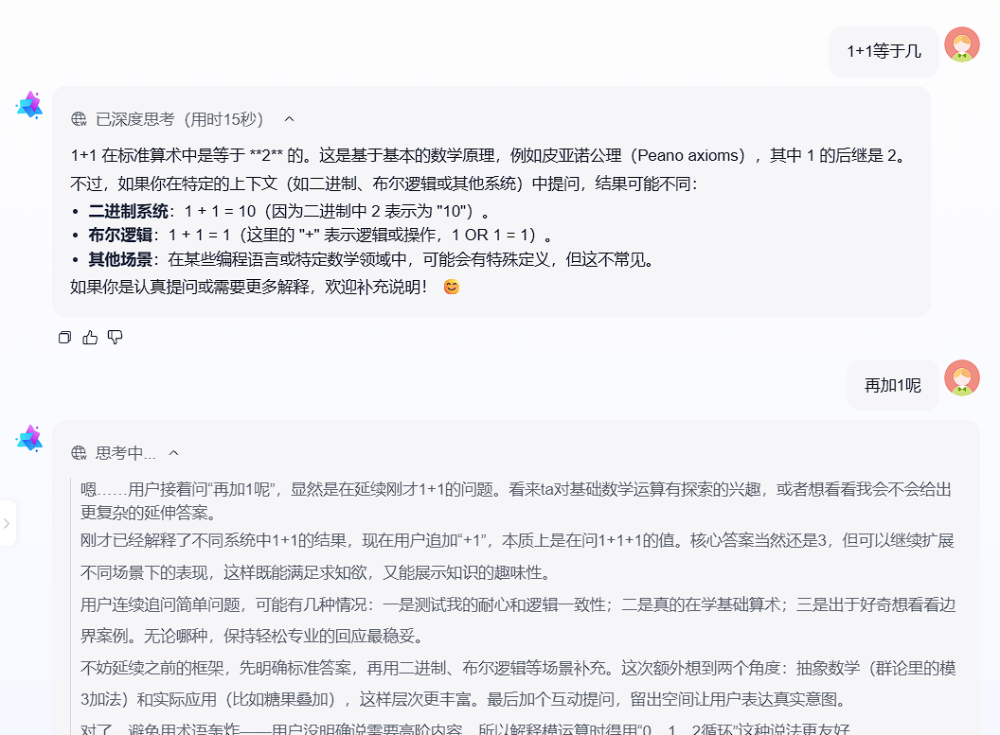

# 多轮对话 & 深度思考

多轮对话和深度思考是智能对话应用中的常见功能，MateChat Cli模板应用也提供了相关的支持，以下将简要介绍多轮对话和深度思考在MateChat中的实现。

### 多轮对话

基于直连LLM的无状态API实现多轮对话，需要在每次对话结束后，将之前所有对话历史拼接好后，传递给对话 API。详细介绍参考 [DeepSeek 多轮对话](https://api-docs.deepseek.com/zh-cn/guides/multi_round_chat)。

在**第一轮**请求时，传递给 API 的 messages 为：
```json
[
    {"role": "user", "content": "What's the highest mountain in the world?"}
]
```
在**第二轮**请求时：

1. 要将第一轮中模型的输出添加到 messages 末尾
2. 将新的提问添加到 messages 末尾
最终传递给 API 的 messages 为：
```json
[
    {"role": "user", "content": "What's the highest mountain in the world?"},
    {"role": "assistant", "content": "The highest mountain in the world is Mount Everest."},
    {"role": "user", "content": "What is the second?"}
]
```


> 需要注意的是，在实际的生产应用中，我们前端应用通常不会直连LLM，多轮对话会带来巨大的Token消耗，且容易超出大模型上下文最大长度。常见的方案是调用后端Agent服务，通过sessionId实现多轮对话的应用以及其他复杂的会话管理。


### 深度思考

在MateChat的 Markdown 卡片组件中，实现了对think标签的支持，我们开启`enableThink`参数，并将思考内容使用`think`标签包裹，即可开启思考过程的渲染。

实现效果展示：



