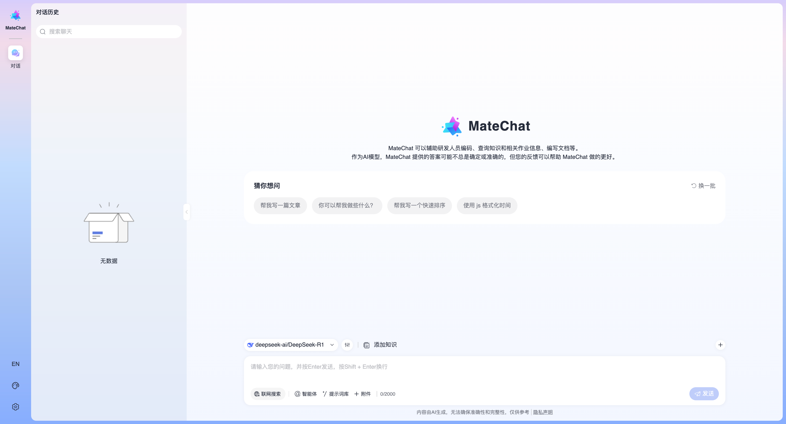
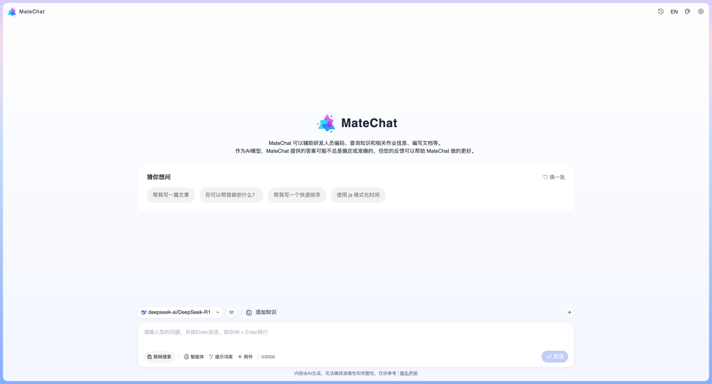
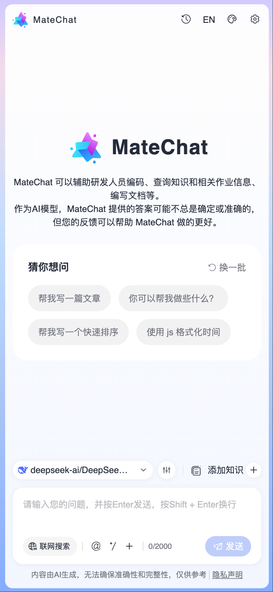
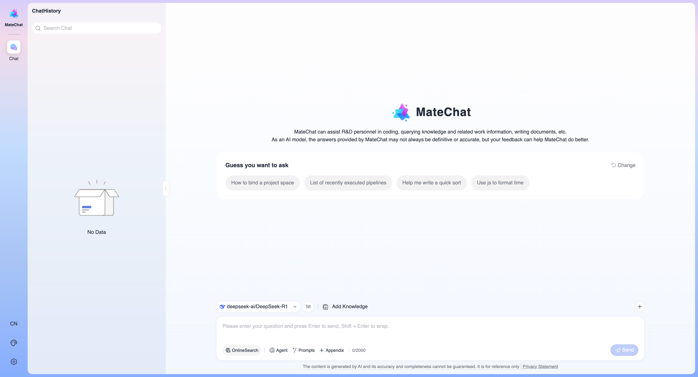

# 通过Cli创建应用

### 创建一个应用

可通过如下命令创建一个应用：

```bash
// npm
npm create matechat@latest

// pnpm
pnpm create matechat@latest
```

这一指令会安装并执行[create-matechat](https://gitcode.com/DevCloudFE/MateChat/tree/dev/packages/create-matechat)，你将会看到一些创建提示：

```bash
Please input the project name: matechat-project
Please select the template: Vue Starter
```

应用创建完成后通过以下命令安装依赖并启动开发：

```bash
cd <your-project-name>
npm i
npm run dev
```

默认情况下，应用内容如下：



### 模型适配

应用默认使用的Mock数据进行对话，在`src/models/config.ts`文件中做如下修改可启用真实模型进行对话：

```ts
export const MODEL_CONFIGS = {
  //...
  enableMock: false, // 是否使用mock数据
};
```

应用默认接入了`DeepSeek`，在`src/models/config.ts`文件的`LLM_MODELS`配置中填充自己申请的`apiKey`可使用模型进行对话，如需要接入其他模型，可参考`LLM_MODELS`的配置自行补充。

### 配置化

在`src/global-config.ts`文件中可对应用进行简单的配置，比如将模板修改为助手式，此时将隐藏左侧导航栏，历史记录将移动到右上角。

配置如下：

```ts
// src/global-config.ts
export default {
  displayShape: 'Assistant',
  //...
};
```

效果如下：



### 响应式

默认已支持响应式和移动端适配。



### 主题化

默认已支持深色和浅色主题，可在`src/global-config.ts`文件中配置只显示一种主题。


### 国际化

默认已支持中英文两套语言，可在`src/global-config.ts`文件中配置只显示一种语言。

