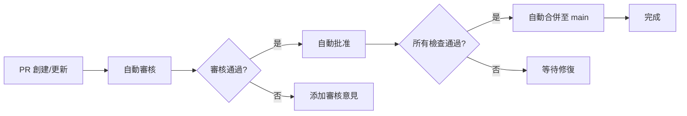

# 🤖 自動審核與合併 (Auto Review & Merge)

## 📋 概述 (Overview)

自動審核與合併工作流程會自動審核所有 Pull Request，修復常見的代碼問題，並在審核通過後自動合併至 `main` 分支。

This automated review and merge workflow automatically reviews all Pull Requests, fixes common code issues, and automatically merges approved PRs to the `main` branch.

## ✨ 功能特性 (Features)

### 1. 自動審核 (Auto Review)
- ✅ 自動分析 PR 中的代碼變更
- 🔍 檢測常見的代碼問題
- 📊 生成詳細的審核報告
- ✅ 自動批准通過審核的 PR

### 2. 自動修復 (Auto Fix)
- 🔧 自動修復未使用的 import
- 🎨 修復代碼格式問題
- 📝 修正簡單的語法錯誤
- ⚡ 優化代碼質量

### 3. 自動合併 (Auto Merge)
- 🔀 自動合併已批准的 PR
- ⏳ 等待所有檢查完成
- 📝 使用 squash merge 保持歷史記錄整潔
- 💬 自動添加合併通知

## 🚀 使用方式 (Usage)

### 自動觸發 (Automatic Trigger)

工作流程會在以下情況下自動觸發：

- 當 PR 被創建時
- 當 PR 被更新時
- 當 PR 從草稿狀態變為就緒狀態時

### 手動觸發 (Manual Trigger)

您也可以手動觸發工作流程：

1. 前往 GitHub Actions 頁面
2. 選擇 "🤖 自動審核與合併" 工作流程
3. 點擊 "Run workflow"
4. （可選）輸入要審核的 PR 編號

## 📊 工作流程 (Workflow)



## ⚙️ 配置 (Configuration)

### 配置文件 (Configuration File)

工作流程配置位於 `.github/auto-review-config.yml`，您可以自定義：

- 📁 文件模式（要分析的文件類型）
- 🚫 排除路徑（不需要分析的目錄）
- ⏱️ 檢查等待時間
- 🔀 合併方式和目標分支
- 🔧 自動修復選項
- 💬 通知設置

範例配置：
```yaml
merge:
  method: squash  # 可選: squash, merge, rebase
  target_branches:
    - main
    - master
```

**注意：** 合併方式需要在工作流程文件 `.github/workflows/auto-review-merge.yml` 的 `env.AUTO_MERGE_METHOD` 中設置。默認為 `squash`。

要更改合併方式，請編輯工作流程文件：
```yaml
env:
  AUTO_MERGE_METHOD: squash  # 或 merge, rebase
```

### 權限要求 (Required Permissions)

工作流程需要以下權限：

```yaml
permissions:
  contents: write        # 用於合併 PR
  pull-requests: write   # 用於審核和評論
  checks: read          # 用於讀取檢查狀態
  statuses: read        # 用於讀取狀態
```

### 合併方式 (Merge Method)

默認使用 **squash merge**，這樣可以：

- 📦 將所有提交壓縮為一個
- 📝 保持 main 分支歷史記錄整潔
- 🎯 更容易追蹤功能變更

## 📝 審核標準 (Review Criteria)

自動審核會檢查以下項目：

### ✅ 通過條件 (Pass Criteria)

1. **代碼質量**
   - 沒有語法錯誤
   - 沒有嚴重的代碼問題
   - 符合項目代碼規範

2. **測試通過**
   - 所有 CI 檢查通過
   - 測試覆蓋率達標
   - 構建成功

3. **安全性**
   - 沒有安全漏洞
   - 依賴項安全
   - 沒有敏感信息洩露

### ❌ 失敗條件 (Fail Criteria)

1. 存在嚴重的代碼問題
2. CI 檢查失敗
3. 測試失敗
4. 發現安全漏洞
5. 代碼衝突

## 🔧 自動修復功能 (Auto-Fix Features)

### 支持的修復類型

1. **未使用的 Import**
   - 自動移除未使用的導入語句
   - 支持 TypeScript, JavaScript, Python

2. **代碼格式**
   - 自動格式化代碼
   - 符合項目風格指南

3. **簡單錯誤**
   - 修復簡單的語法錯誤
   - 修正常見的邏輯問題

## 📈 統計報告 (Statistics Report)

每次審核都會生成詳細的統計報告：

- 📁 總文件數
- 📊 各類型文件數量
- 🔧 自動修復的問題數
- ⏱️ 處理時間
- ✅ 審核結果

## 🛡️ 安全性 (Security)

### 安全措施

1. **權限控制**
   - 僅授予必要的權限
   - 使用 GitHub Token 認證

2. **審核檢查**
   - 多重檢查機制
   - 等待所有 CI 檢查完成

3. **錯誤處理**
   - 完善的錯誤處理機制
   - 失敗時不會影響 main 分支

## 🔍 監控與日誌 (Monitoring & Logging)

### 查看日誌

1. 前往 GitHub Actions 頁面
2. 選擇工作流程執行記錄
3. 查看詳細的執行日誌

### 監控指標

- ✅ 審核成功率
- 🔧 自動修復成功率
- 🔀 自動合併成功率
- ⏱️ 平均處理時間

## 🚨 故障排除 (Troubleshooting)

### 常見問題

#### 1. 合併失敗

**原因：**
- 存在代碼衝突
- CI 檢查未通過
- 權限不足

**解決方案：**
- 解決代碼衝突
- 修復 CI 失敗
- 檢查 GitHub Token 權限

#### 2. 審核未觸發

**原因：**
- PR 處於草稿狀態
- 工作流程配置錯誤

**解決方案：**
- 將 PR 標記為就緒
- 檢查工作流程配置文件

#### 3. 自動修復失敗

**原因：**
- 代碼問題過於複雜
- 缺少必要的工具

**解決方案：**
- 手動修復問題
- 安裝必要的依賴

## 📚 相關資源 (Related Resources)

- [GitHub Actions 文檔](https://docs.github.com/en/actions)
- [Pull Request 最佳實踐](https://docs.github.com/en/pull-requests)
- [代碼審核指南](https://google.github.io/eng-practices/review/)

## 🤝 貢獻 (Contributing)

如果您想改進自動審核與合併工作流程：

1. Fork 這個倉庫
2. 創建您的特性分支
3. 提交您的更改
4. 推送到您的分支
5. 創建一個 Pull Request

## 📝 更新日誌 (Changelog)

### v1.0.0 (2025-11-22)
- ✨ 初始版本發布
- 🔍 自動審核功能
- 🔧 自動修復功能
- 🔀 自動合併功能

## 📄 授權 (License)

本項目為開源項目。

---

**注意：** 此工作流程仍在持續改進中，歡迎提供反饋和建議！

**Note:** This workflow is continuously being improved. Feedback and suggestions are welcome!
