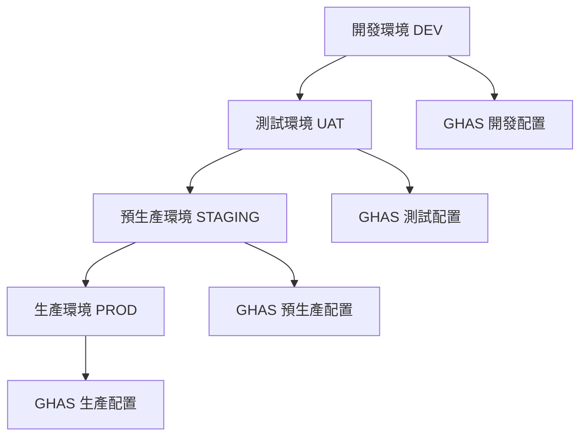

# 部署架構與環境準備

## GitHub Enterprise 環境配置

### 基本環境需求

在開始部署 GitHub Advanced Security (GHAS) 之前，需要確保您的環境符合以下要求：

- GitHub Enterprise Cloud 或 GitHub Enterprise Server 3.1+
- 具備組織管理員權限
- 已啟用 GitHub Advanced Security 授權

### 授權配置步驟

1. **啟用 GHAS 授權**

```bash
# 使用 GitHub CLI 啟用組織層級的 Advanced Security
gh api \
  --method PATCH \
  /orgs/{org}/actions/permissions \
  --field enabled=true \
  --field allowed_actions=all
```

**注意**: 請將 `{org}` 替換為您的組織名稱，並使用有效的 GitHub Personal Access Token (PAT) 進行認證。

2. **設定組織安全策略**

組織安全策略配置請參考 `.github/security-policy.yml` 文件。

## 環境隔離架構設計

### 多環境部署策略

建立清晰的環境隔離是企業級部署的關鍵：



### 環境配置建議

| 環境 | GHAS 功能 | 掃描頻率 | 警報級別 |
|------|-----------|----------|----------|
| DEV | CodeQL, Secret Scanning | 每次 Push | 所有級別 |
| UAT | 完整 GHAS | 每日 | Medium 以上 |
| STAGING | 完整 GHAS | 每次 PR | High 以上 |
| PROD | 完整 GHAS | 持續監控 | Critical 以上 |

### 權限管理配置

1. **建立安全團隊**

```bash
# 建立安全團隊並分配權限
gh api \
  --method POST \
  /orgs/{org}/teams \
  --field name="security-team" \
  --field description="Enterprise Security Team" \
  --field privacy="closed"
```

2. **設定倉庫存取權限**

權限配置示例：

```json
{
  "teams": {
    "security-team": {
      "permission": "admin",
      "repositories": ["all"]
    },
    "development-team": {
      "permission": "write",
      "repositories": ["dev/*", "staging/*"]
    },
    "operations-team": {
      "permission": "read",
      "repositories": ["prod/*"]
    }
  }
}
```

## 基礎設施配置

### GitHub Actions Runner 設定

針對企業級部署，建議使用自託管 Runner。詳細設定請參考 `.github/workflows/setup-runner.yml` 文件。

#### 自託管 Runner 的優勢

- **安全性**: 在受控環境中執行工作流程
- **效能**: 可以使用更強大的硬體資源
- **合規性**: 符合企業資料不出境要求
- **成本**: 對於大量使用可降低成本

#### Runner 標籤策略

建議使用以下標籤組合：

- `enterprise`: 企業級 Runner
- `security`: 用於安全掃描
- `production`: 生產環境專用
- `high-memory`: 高記憶體需求任務
- `gpu`: GPU 加速任務

### 網路安全配置

網路安全配置請參考 `config/security-network-config.yml` 文件。

#### 網路安全最佳實踐

1. **IP 白名單**: 限制只有企業內網和 VPN 可以訪問
2. **Webhook 安全**: 使用密鑰驗證所有 webhook 請求
3. **API 速率限制**: 防止 API 濫用
4. **TLS/SSL**: 強制使用 HTTPS 通訊

## 監控與日誌配置

### Elasticsearch 整合

Elasticsearch 整合配置請參考 `config/elasticsearch-config.sh` 腳本。

#### 日誌收集策略

- **實時收集**: 所有安全事件即時記錄
- **結構化存儲**: 使用統一的日誌格式
- **長期保留**: 至少保留 90 天的安全日誌
- **快速查詢**: 建立適當的索引以加速查詢

### Prometheus 指標收集

Prometheus 配置請參考 `config/prometheus-config.yml` 文件。

#### 監控指標

建議監控以下關鍵指標：

- **安全掃描次數**: 追蹤掃描執行頻率
- **發現的漏洞數量**: 按嚴重程度分類
- **修復時間**: 從發現到修復的平均時間
- **API 使用量**: 監控 API 配額使用情況
- **Runner 健康狀態**: 確保 Runner 正常運行

### 告警配置

建議配置以下告警規則：

1. **Critical 級別漏洞**: 立即通知安全團隊
2. **Secret 洩漏**: 即時告警並自動阻止 push
3. **API 配額達標**: 達到 80% 時發出警告
4. **Runner 離線**: Runner 停止響應時告警

## 部署檢查清單

在完成部署後，請確認以下項目：

- [ ] GHAS 授權已啟用
- [ ] 組織安全策略已配置
- [ ] 環境隔離已建立
- [ ] 團隊權限已設定
- [ ] 自託管 Runner 已安裝並運行
- [ ] 網路安全規則已應用
- [ ] Elasticsearch 日誌收集正常
- [ ] Prometheus 監控指標可見
- [ ] 告警規則已測試
- [ ] 文檔已更新

## 後續步驟

完成基礎架構配置後，您可以繼續進行：

1. **CodeQL 配置**: 設定程式碼掃描規則
2. **Secret Scanning**: 配置密鑰掃描策略
3. **Dependency Review**: 啟用依賴項審查
4. **Security Policies**: 定義安全政策和程序

## 疑難排解

### 常見問題

**Q: 如何驗證 GHAS 是否已正確啟用？**

A: 使用以下命令檢查：

```bash
gh api /orgs/{org}/settings/security_analysis
```

**Q: 自託管 Runner 無法連接到 GitHub？**

A: 檢查網路配置，確保可以訪問 `github.com` 和 `api.github.com`。

**Q: 如何處理誤報的安全警報？**

A: 在 Security 標籤中可以將警報標記為 false positive 或 won't fix。

## 支援與資源

- [GitHub Advanced Security 官方文檔](https://docs.github.com/en/enterprise-cloud@latest/get-started/learning-about-github/about-github-advanced-security)
- [GitHub Actions 文檔](https://docs.github.com/en/actions)
- [CodeQL 文檔](https://codeql.github.com/docs/)

---

這些配置為後續的 CodeQL、Secret Scanning 等功能提供了堅實的基礎架構支撐。
