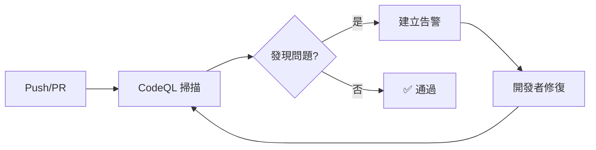

# 安全培訓指南 / Security Training Guide

## 概述

本指南為團隊成員提供 GitHub Advanced Security (GHAS) 的完整培訓材料，涵蓋從基礎到進階的所有安全實踐。

## 培訓目標

完成培訓後，您將能夠：

- ✅ 理解 GHAS 的核心功能和價值
- ✅ 使用 CodeQL 進行代碼安全審查
- ✅ 識別和處理秘密洩露
- ✅ 管理和修復安全漏洞
- ✅ 遵循安全開發最佳實踐

## 培訓模組

### Module 1: GHAS 簡介 (30 分鐘)

#### 學習目標
- 了解 GHAS 是什麼以及為什麼重要
- 認識三大核心功能：CodeQL、Secret Scanning、Dependabot

#### 內容
1. **什麼是 GHAS？**
   - GitHub Advanced Security 是一套企業級安全工具
   - 整合在開發工作流程中
   - 自動化安全檢測和修復

2. **為什麼需要 GHAS？**
   - 提早發現安全問題（Shift Left）
   - 減少手動安全審查工作
   - 符合合規要求（SOC 2、ISO 27001、GDPR）
   - 降低安全風險和成本

3. **核心功能**
   - **CodeQL**: 靜態代碼分析 (SAST)
   - **Secret Scanning**: 秘密檢測和保護
   - **Dependabot**: 依賴項漏洞管理

#### 實踐練習
- 瀏覽 Security 標籤
- 查看現有的安全告警
- 了解告警的嚴重程度分類

#### 資源
- [GHAS 完整指南](./GHAS_COMPLETE_GUIDE.md)
- [GitHub Security 官方文檔](https://docs.github.com/en/code-security)

---

### Module 2: CodeQL 代碼掃描 (45 分鐘)

#### 學習目標
- 理解 CodeQL 如何工作
- 學習如何閱讀和處理 CodeQL 告警
- 了解如何在 PR 中使用 CodeQL

#### 內容

**2.1 CodeQL 基礎**
- CodeQL 是什麼：將代碼視為數據的查詢語言
- 支援的語言：JavaScript, Python, Java, C#, Go, C/C++, Swift, Ruby
- 掃描頻率：每週自動掃描 + PR 觸發

**2.2 CodeQL 工作流程**


**2.3 告警嚴重程度**
| 級別 | 說明 | 行動 |
|------|------|------|
| Critical | 可被直接利用的嚴重漏洞 | 立即修復（4h SLA） |
| High | 高風險安全問題 | 優先修復（24h SLA） |
| Medium | 中等風險問題 | 排程修復（1週 SLA） |
| Low | 低風險或代碼品質問題 | 例行修復（1月 SLA） |

**2.4 如何處理 CodeQL 告警**

1. **檢視告警詳情**
   - 前往 Security > Code scanning alerts
   - 點擊具體告警查看詳情
   - 閱讀「Show more」了解問題原因

2. **評估告警**
   - 這是真正的安全問題嗎？
   - 影響範圍有多大？
   - 是否有可用的修復方案？

3. **修復告警**
   ```javascript
   // ❌ 不安全的代碼
   const userInput = req.query.name;
   db.query(`SELECT * FROM users WHERE name = '${userInput}'`);
   
   // ✅ 安全的代碼
   const userInput = req.query.name;
   db.query('SELECT * FROM users WHERE name = ?', [userInput]);
   ```

4. **關閉告警**
   - 修復後自動關閉
   - 如果是誤報，選擇 "Dismiss alert" > "False positive"

#### 實踐練習
1. 查看一個 CodeQL 告警
2. 理解問題所在
3. 提出修復建議
4. （可選）實際修復並提交 PR

#### 資源
- [CodeQL 設定指南](./CODEQL_SETUP.md)
- [CodeQL 查詢文檔](https://codeql.github.com/docs/)

---

### Module 3: Secret Scanning (45 分鐘)

#### 學習目標
- 了解什麼是秘密洩露
- 學習如何防止秘密洩露
- 掌握秘密洩露的處理流程

#### 內容

**3.1 什麼是秘密？**
秘密是用於認證和授權的敏感信息：
- API 金鑰
- 密碼
- 私鑰
- 令牌 (Tokens)
- 連接字串
- OAuth 憑證

**3.2 為什麼秘密洩露危險？**
- 攻擊者可以獲取系統訪問權限
- 可能導致數據洩露
- 造成財務損失
- 違反合規要求

**3.3 秘密檢測類型**

我們檢測 30+ 種秘密模式：
- GitHub PAT
- AWS Access Keys
- Azure Client Secrets
- Database Credentials
- JWT Tokens
- Slack Tokens
- Stripe API Keys
- 自定義企業模式

**3.4 Push Protection**

當您嘗試推送包含秘密的代碼時：
1. Push 被阻擋
2. 顯示檢測到的秘密
3. 您可以：
   - 移除秘密後重新推送
   - 申請旁路（需批准）

**3.5 最佳實踐**

✅ **應該做的事**:
```bash
# 使用環境變數
export DATABASE_URL="postgres://..."
export API_KEY="sk-..."

# 使用 .env 文件（加入 .gitignore）
echo ".env" >> .gitignore
```

❌ **不應該做的事**:
```javascript
// 不要在代碼中硬編碼秘密
const apiKey = "sk-1234567890abcdef";
const dbPassword = "myP@ssw0rd";
```

**3.6 如果意外洩露秘密**

立即行動清單：
1. ✅ **輪換秘密** - 立即撤銷並生成新的憑證
2. ✅ **清理 Git 歷史** - 使用 BFG Repo-Cleaner
3. ✅ **檢查存取日誌** - 確認是否有未授權訪問
4. ✅ **通知團隊** - 告知相關人員
5. ✅ **更新系統** - 在所有地方使用新憑證

```bash
# 清理 Git 歷史
bfg --replace-text secrets.txt repo.git
git push --force --all
```

#### 實踐練習
1. 安裝 pre-push hook: `./scripts/advanced-push-protection.sh install`
2. 嘗試提交包含假秘密的文件
3. 觀察如何被阻擋
4. 正確處理秘密（使用環境變數）

#### 資源
- [Secret Scanning 指南](./SECRET_SCANNING.md)
- [Pre-push Hook 安裝](../scripts/advanced-push-protection.sh)

---

### Module 4: 漏洞管理 (45 分鐘)

#### 學習目標
- 了解依賴項漏洞的影響
- 學習如何使用 Dependabot
- 掌握漏洞修復流程

#### 內容

**4.1 依賴項漏洞**

什麼是依賴項漏洞？
- 第三方庫中發現的安全問題
- 可能影響您的應用程式
- 通過 CVE 編號追蹤

**4.2 Dependabot 自動化**

Dependabot 會：
- 掃描依賴項漏洞
- 自動建立更新 PR
- 提供修復建議
- 追蹤 SLA

**4.3 SLA 驅動的修復流程**

| 嚴重度 | SLA | 自動合併 | 策略 |
|--------|-----|----------|------|
| Critical | 4 小時 | ✅ | 立即 Hotfix |
| High | 24 小時 | ❌ | 優先修補 |
| Moderate | 1 週 | ❌ | 排程更新 |
| Low | 1 月 | ✅ | 例行維護 |

**4.4 處理 Dependabot PR**

1. **審查 PR**
   - 檢查變更內容
   - 查看 changelog
   - 評估影響範圍

2. **測試**
   - CI 自動運行測試
   - 進行額外的手動測試（如需要）
   - 驗證功能正常

3. **合併**
   - Patch/Minor 更新：自動合併
   - Major 更新：需要審查

#### 實踐練習
1. 查看開放的 Dependabot PR
2. 審查更新內容
3. 理解 SLA 要求
4. 測試並合併安全更新

#### 資源
- [漏洞管理文檔](./VULNERABILITY_MANAGEMENT.md)
- [Dependabot 配置](../.github/dependabot.yml)

---

### Module 5: 安全開發實踐 (60 分鐘)

#### 學習目標
- 掌握安全編碼原則
- 學習常見漏洞和防護
- 建立安全開發習慣

#### 內容

**5.1 安全編碼原則**

1. **最小權限原則**
   - 只授予必要的權限
   - 及時撤銷不需要的訪問

2. **深度防禦**
   - 多層安全控制
   - 不依賴單一防護措施

3. **失敗安全**
   - 錯誤情況下保持安全
   - 不暴露敏感信息

**5.2 OWASP Top 10**

必須了解的十大安全風險：
1. Broken Access Control
2. Cryptographic Failures
3. Injection
4. Insecure Design
5. Security Misconfiguration
6. Vulnerable Components
7. Authentication Failures
8. Software and Data Integrity Failures
9. Logging and Monitoring Failures
10. Server-Side Request Forgery

**5.3 常見漏洞和防護**

**SQL 注入**
```javascript
// ❌ 不安全
db.query(`SELECT * FROM users WHERE id = ${userId}`);

// ✅ 安全 - 使用參數化查詢
db.query('SELECT * FROM users WHERE id = ?', [userId]);
```

**XSS (跨站腳本)**
```javascript
// ❌ 不安全
element.innerHTML = userInput;

// ✅ 安全 - 轉義輸出
element.textContent = userInput;
```

**CSRF (跨站請求偽造)**
```javascript
// ✅ 使用 CSRF 令牌
<form method="POST">
  <input type="hidden" name="_csrf" value="{{ csrfToken }}">
  ...
</form>
```

**5.4 Code Review 檢查清單**

審查代碼時檢查：
- [ ] 輸入驗證
- [ ] 輸出編碼
- [ ] 認證和授權
- [ ] 敏感數據處理
- [ ] 錯誤處理
- [ ] 日誌記錄
- [ ] 第三方依賴

#### 實踐練習
1. 審查一段代碼，識別潛在安全問題
2. 提出改進建議
3. 參與代碼審查討論

#### 資源
- [OWASP Top 10](https://owasp.org/www-project-top-ten/)
- [Security Checklist](https://github.com/shieldfy/API-Security-Checklist)

---

## 實踐專案

### 專案：修復安全告警

**目標**: 選擇一個安全告警並完整修復

**步驟**:
1. 選擇一個 Medium 或 Low 級別的告警
2. 研究問題原因
3. 設計修復方案
4. 實施修復
5. 提交 PR
6. 獲取審查
7. 合併並驗證修復

**評估標準**:
- 正確理解問題
- 修復方案適當
- 代碼品質良好
- 包含適當的測試
- 文檔完整

---

## 認證考核

完成所有模組後，您需要通過考核：

### 理論測試 (30 分鐘)
- 20 個選擇題
- 涵蓋所有模組內容
- 70% 通過分數

### 實踐測試 (60 分鐘)
- 修復 3 個不同類型的安全問題
- 正確使用 GHAS 工具
- 遵循最佳實踐

---

## 持續學習

安全是持續的過程，建議：

### 每週
- 查看新的安全告警
- 參與代碼審查
- 學習新的安全模式

### 每月
- 閱讀安全博客
- 參加安全研討會
- 更新安全知識

### 每季
- 參加進階培訓
- 複習 OWASP Top 10
- 分享安全經驗

---

## 資源清單

### 內部文檔
- [GHAS 完整指南](./GHAS_COMPLETE_GUIDE.md)
- [CodeQL 設定](./CODEQL_SETUP.md)
- [Secret Scanning](./SECRET_SCANNING.md)
- [漏洞管理](./VULNERABILITY_MANAGEMENT.md)

### 外部資源
- [GitHub Security Lab](https://securitylab.github.com/)
- [OWASP](https://owasp.org/)
- [CWE](https://cwe.mitre.org/)
- [NIST](https://www.nist.gov/cybersecurity)

### 工具
- [CodeQL CLI](https://codeql.github.com/docs/codeql-cli/)
- [BFG Repo-Cleaner](https://rtyley.github.io/bfg-repo-cleaner/)
- [git-secrets](https://github.com/awslabs/git-secrets)

---

## 支援

### 獲取幫助
- **Slack**: #security-training
- **Email**: security-training@example.com
- **內部 Wiki**: security.example.com/training

### 反饋
我們歡迎您的反饋以改進培訓材料！
- 通過 Slack 提供建議
- 提交 GitHub Issue
- 參加月度培訓會議

---

**培訓版本**: 1.0.0  
**最後更新**: 2025-11-22  
**維護者**: Security Team
