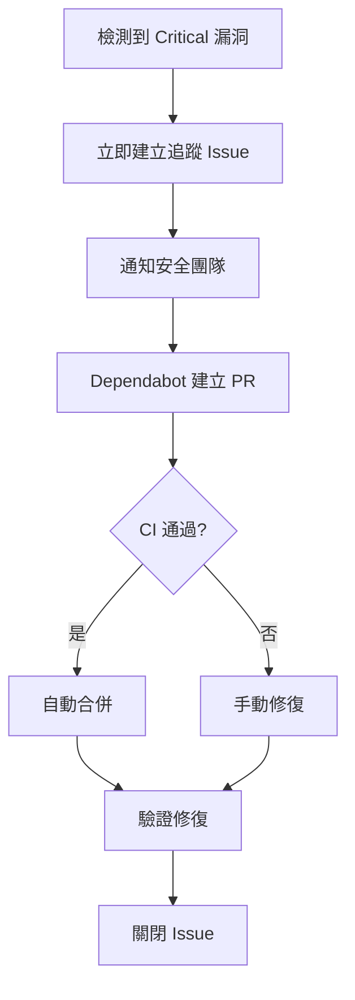
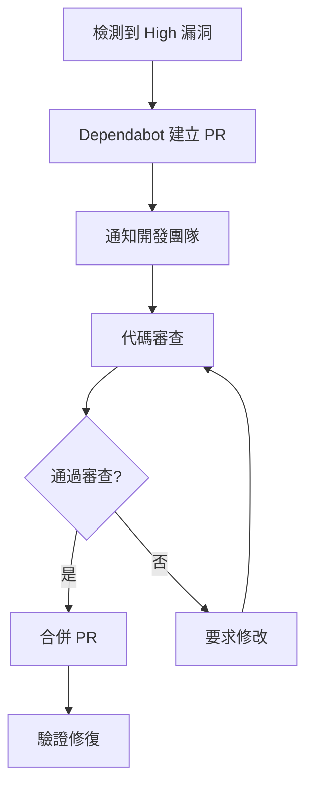

# 漏洞告警處理與自動化修復

## 概述

本文檔說明如何在 SLASolve 專案中實施企業級漏洞管理，包括自動化告警處理、優先級分類和智能修復流程。

## 核心功能

### 1. 漏洞告警分類

根據嚴重度和告警存在時間自動分類：

| 類別 | 嚴重度 | 處理時限 | 策略 |
|------|--------|---------|------|
| Critical Immediate | Critical | 4 小時 | 立即 Hotfix，自動合併 |
| High Urgent | High 或逾期 7 天的 Moderate | 24 小時 | 優先修補，需要審核 |
| Moderate Scheduled | Moderate 或逾期 30 天 | 1 週 | 排程更新，需要審核 |
| Low Routine | Low | 1 個月 | 例行維護，自動合併 |

### 2. 自動化修復工作流程

工作流程位於 `.github/workflows/auto-vulnerability-fix.yml`，提供：

- **每日自動掃描**: 每天早上 8 點自動執行
- **手動觸發選項**: 可自訂嚴重度閾值和自動合併設定
- **智能 PR 管理**: 自動啟用 Dependabot 並管理 PR
- **追蹤 Issue**: 為 Critical 漏洞自動建立追蹤 Issue
- **安全報告**: 生成詳細的安全報告

### 3. 漏洞管理工具

Python 工具 `scripts/vulnerability-alert-handler.py` 提供：

- 取得組織或倉庫的漏洞告警
- 自動分類和優先級排序
- 生成修復計畫
- 產生安全建議報告

## 使用指南

### 基本使用

#### 檢視漏洞告警

```bash
# 設定 GitHub Token
export GITHUB_TOKEN="your_token"

# 檢視組織的所有漏洞
./scripts/vulnerability-alert-handler.py \
  --org your-org

# 檢視特定倉庫的漏洞
./scripts/vulnerability-alert-handler.py \
  --org your-org \
  --repo your-repo

# 只顯示 high 以上的漏洞
./scripts/vulnerability-alert-handler.py \
  --org your-org \
  --severity-threshold high
```

#### 生成報告

```bash
# 生成 Markdown 報告
./scripts/vulnerability-alert-handler.py \
  --org your-org \
  --output-format markdown \
  --output-file security-report.md

# 生成 JSON 格式的修復計畫
./scripts/vulnerability-alert-handler.py \
  --org your-org \
  --output-format json \
  --output-file remediation-plan.json
```

### 自動化工作流程

#### 手動觸發修復

1. 前往 GitHub Actions 標籤
2. 選擇 "Automated Vulnerability Remediation"
3. 點擊 "Run workflow"
4. 配置選項：
   - **severity_threshold**: 最低嚴重度 (low/moderate/high/critical)
   - **auto_merge**: 是否自動合併安全更新
   - **dry_run**: 試運行模式（不實際修改）

#### 每日自動掃描

工作流程每天早上 8 點自動執行：

1. 掃描所有開放的漏洞告警
2. 分析和分類漏洞
3. 啟用 Dependabot 安全更新
4. 對於 Critical 漏洞建立追蹤 Issue
5. 配置自動合併（如啟用）
6. 生成安全報告

## 工作流程詳解

### 漏洞評估階段

```yaml
vulnerability-assessment:
  # 1. 取得漏洞告警
  # 2. 根據嚴重度分類
  # 3. 統計 Critical 和 High 數量
  # 4. 生成分析結果 JSON
```

**輸出**:
- `has-vulnerabilities`: 是否有漏洞
- `critical-count`: Critical 級別數量
- `high-count`: High 級別數量

### Dependabot 啟用

```yaml
enable-dependabot:
  # 確保 Dependabot 安全更新已啟用
  # 只在發現漏洞時執行
```

### 修復 PR 建立

```yaml
create-remediation-prs:
  # 1. 觸發 Dependabot 更新
  # 2. 列出受影響的套件
  # 3. 為 Critical 漏洞建立追蹤 Issue
```

**追蹤 Issue 內容**:
- 漏洞摘要統計
- 自動化動作清單
- 後續步驟指引
- SLA 目標時間

### 自動合併

```yaml
auto-merge-safe-updates:
  # 1. 取得所有 Dependabot PR
  # 2. 識別安全的更新（patch/minor）
  # 3. 啟用自動合併
  # 4. 跳過 major 更新
```

**自動合併規則**:
- ✅ Patch 版本更新
- ✅ Minor 版本更新
- ❌ Major 版本更新（需要手動審核）

### 報告生成

```yaml
generate-report:
  # 1. 生成詳細的安全報告
  # 2. 上傳為 artifact
  # 3. 在 Summary 中顯示摘要
```

## 漏洞處理流程

### Critical 漏洞處理



**處理時限**: 4 小時

### High 漏洞處理



**處理時限**: 24 小時

### Moderate/Low 漏洞處理

- **Moderate**: 排程在下一個 Sprint 處理
- **Low**: 納入例行維護週期

## 漏洞分析工具

### VulnerabilityManager 類別

```python
from vulnerability_alert_handler import VulnerabilityManager

# 初始化
vm = VulnerabilityManager(token="your_token", org="your-org")

# 取得告警
alerts = vm.get_vulnerability_alerts(repo="your-repo")

# 分類告警
categorized = vm.categorize_alerts(alerts)

# 建立修復計畫
plan = vm.create_remediation_plan(categorized)

# 生成報告
report = vm.generate_security_advisory(alerts)
```

### VulnerabilityAlert 資料結構

```python
@dataclass
class VulnerabilityAlert:
    id: str                    # 告警 ID
    severity: str              # 嚴重度
    package_name: str          # 套件名稱
    affected_version: str      # 受影響版本
    fixed_version: str         # 修復版本
    cve_id: str               # CVE 編號
    repository: str            # 倉庫名稱
    created_at: str           # 建立時間
    manifest_path: str        # Manifest 路徑
```

## 整合與自動化

### CI/CD 整合

在您的 CI/CD 管道中整合漏洞檢查：

```yaml
# 在部署前檢查漏洞
- name: Check Vulnerabilities
  run: |
    python3 scripts/vulnerability-alert-handler.py \
      --org ${{ github.repository_owner }} \
      --repo ${{ github.event.repository.name }} \
      --severity-threshold high \
      --output-format json
    
    # 如果有 critical 漏洞，阻止部署
    CRITICAL=$(jq '.critical_immediate.count // 0' vulnerability-analysis.json)
    if [ $CRITICAL -gt 0 ]; then
      echo "❌ 部署被阻止: 發現 $CRITICAL 個 Critical 漏洞"
      exit 1
    fi
```

### Slack 通知整合

```bash
# 發送 Slack 通知
curl -X POST $SLACK_WEBHOOK_URL \
  -H 'Content-Type: application/json' \
  -d '{
    "text": "🚨 Critical Security Alert",
    "blocks": [
      {
        "type": "section",
        "text": {
          "type": "mrkdwn",
          "text": "*'$CRITICAL_COUNT'* critical vulnerabilities detected"
        }
      }
    ]
  }'
```

### Jira 整合

```python
# 為 Critical 漏洞建立 Jira ticket
import requests

def create_jira_ticket(alert):
    jira_api = "https://your-jira.atlassian.net/rest/api/2/issue"
    
    data = {
        "fields": {
            "project": {"key": "SEC"},
            "summary": f"[Security] {alert.package_name} - {alert.cve_id}",
            "description": f"Critical vulnerability in {alert.package_name}",
            "issuetype": {"name": "Bug"},
            "priority": {"name": "Highest"}
        }
    }
    
    response = requests.post(jira_api, json=data, auth=(user, token))
    return response.json()
```

## 最佳實踐

### 1. SLA 管理

建立明確的 SLA 目標：

```yaml
sla_targets:
  critical:
    response_time: 1 hour
    resolution_time: 4 hours
  high:
    response_time: 4 hours
    resolution_time: 24 hours
  moderate:
    response_time: 24 hours
    resolution_time: 1 week
  low:
    response_time: 1 week
    resolution_time: 1 month
```

### 2. 測試策略

在修復漏洞前後進行充分測試：

```bash
# 修復前
npm test
npm run e2e

# 應用修復
npm update vulnerable-package

# 修復後
npm test
npm run e2e

# 效能測試
npm run performance-test
```

### 3. 回滾計畫

為每個修復準備回滾計畫：

```bash
# 記錄當前版本
git tag pre-security-fix-$(date +%Y%m%d)

# 如需回滾
git revert <commit-sha>
git push origin main
```

### 4. 溝通協調

建立清晰的溝通流程：

1. **發現階段**: 自動通知相關團隊
2. **分析階段**: 安全團隊評估影響
3. **修復階段**: 開發團隊實施修復
4. **驗證階段**: QA 團隊驗證修復
5. **部署階段**: DevOps 團隊部署到生產

## 監控與報告

### 關鍵指標

追蹤以下 KPI：

- **MTTD** (Mean Time To Detect): 平均檢測時間
- **MTTR** (Mean Time To Remediate): 平均修復時間
- **修復率**: 已修復 / 總漏洞數
- **SLA 達成率**: 在 SLA 內修復的百分比
- **重開率**: 修復後重新出現的漏洞

### Dashboard 建議

建議建立以下 Dashboard：

1. **漏洞概覽**
   - 總漏洞數量
   - 按嚴重度分布
   - 趨勢圖表

2. **修復進度**
   - 開放漏洞
   - 修復中漏洞
   - 已修復漏洞

3. **SLA 追蹤**
   - 超過 SLA 的漏洞
   - 平均修復時間
   - SLA 達成率

4. **套件健康度**
   - 最常出現漏洞的套件
   - 過時的依賴項
   - 建議更新

### 報告範例

工具生成的報告包含：

```markdown
# 漏洞安全建議報告

生成時間: 2025-11-22 10:00:00

## 摘要統計

總漏洞數量: **25**

### 依嚴重度分布

🔴 **CRITICAL**: 2
🟠 **HIGH**: 5
🟡 **MODERATE**: 10
🟢 **LOW**: 8

### 受影響套件 TOP 10

1. **lodash**: 3 個漏洞
2. **axios**: 2 個漏洞
3. **express**: 2 個漏洞
...

## 修復建議

### 🚨 立即行動項目（Critical）

#### lodash
- **Repository**: org/repo
- **Manifest**: `package.json`
- **CVE**: CVE-2021-23337
- **修復版本**: >= 4.17.21
- **告警 ID**: #123
```

## 疑難排解

### 常見問題

**Q: Dependabot 沒有建立 PR？**

A: 檢查以下項目：
1. Dependabot 是否已啟用
2. 是否有有效的 manifest 文件
3. 檢查 Dependabot 日誌

```bash
gh api /repos/{owner}/{repo}/dependabot/alerts
```

**Q: 自動合併沒有觸發？**

A: 確認：
1. `auto_merge` 參數設為 `true`
2. PR 是 patch 或 minor 更新
3. CI 檢查全部通過
4. 有足夠的權限

**Q: 如何處理誤報？**

A: 
```bash
# 在 GitHub UI 中關閉告警
# 或使用 API
gh api --method PATCH \
  /repos/{owner}/{repo}/dependabot/alerts/{alert_number} \
  -f state=dismissed \
  -f dismissed_reason=inaccurate
```

### 獲取支援

- 查閱 [Dependabot 文檔](https://docs.github.com/en/code-security/dependabot)
- 聯繫安全團隊
- 開啟 GitHub Issue

## 相關資源

- [GitHub Dependabot 文檔](https://docs.github.com/en/code-security/dependabot)
- [CVE 資料庫](https://cve.mitre.org/)
- [National Vulnerability Database](https://nvd.nist.gov/)
- [OWASP Dependency Check](https://owasp.org/www-project-dependency-check/)

---

**最後更新**: 2025-11-22  
**維護者**: SLASolve Security Team
