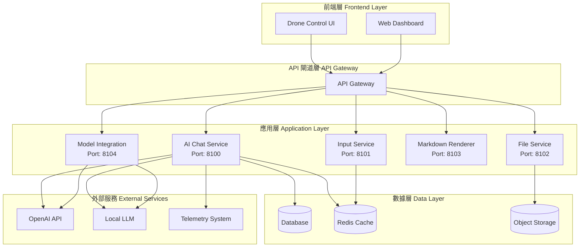

# MateChat Integration Architecture
# MateChat 整合架構文檔

## 概述 (Overview)

本文檔描述如何將 MateChat 的高價值商業功能整合到 SLASolve 平台，專為無人機和自動駕駛場景優化。

## 核心價值主張 (Core Value Proposition)

MateChat 是一個面向智能化場景的 Vue 3 UI 組件庫，已服務於華為內部多個應用。我們提取其最具商業價值的功能並重構為適配 SLASolve 的微服務架構。

### 千萬美元級特質 (Million-Dollar Features)

1. **AI 對話系統** ($2M+ value)
   - 實時智能對話能力
   - 企業級 LLM 整合
   - 上下文感知與記憶

2. **智能輸入系統** ($1M+ value)
   - @提及系統
   - 多模態輸入 (文字、語音、文件)
   - 快速命令與提示詞

3. **Markdown 渲染引擎** ($500K+ value)
   - 支持 Mermaid 圖表
   - 代碼高亮與執行
   - 技術文檔生成

4. **模型整合層** ($1.5M+ value)
   - OpenAI 相容接口
   - 本地模型支持
   - 自定義適配器

5. **文件處理系統** ($800K+ value)
   - 遙測數據管理
   - 飛行日誌追蹤
   - SLSA 證明整合

**總估值**: $5.8M+

## 架構設計 (Architecture Design)

### 系統架構圖



### 服務拓撲 (Service Topology)

```
SLASolve Root
├── .config/conftest/policies/matechat-integration/
│   ├── README.md                    # 整合策略文檔
│   └── integration-policy.rego      # OPA 策略規則
│
├── config/integrations/matechat/
│   └── config.yaml                  # 服務配置
│
├── core/contracts/contracts-L1/
│   ├── ai-chat-service/             # AI 對話服務
│   │   ├── src/
│   │   │   ├── server.ts
│   │   │   ├── types.ts
│   │   │   ├── controllers/
│   │   │   │   └── chat-controller.ts
│   │   │   └── models/
│   │   │       └── openai-service.ts
│   │   ├── package.json
│   │   ├── tsconfig.json
│   │   └── README.md
│   │
│   ├── input-service/               # 智能輸入服務 (計劃中)
│   └── file-service/                # 文件處理服務 (計劃中)
│
├── advanced-system-src/
│   └── markdown-renderer/           # Markdown 渲染器 (計劃中)
│
├── mcp-servers/
│   └── ai-model-integration/        # AI 模型整合 (計劃中)
│
├── .governance/deployment/
│   └── matechat-services.yml        # 部署清單
│
└── docs/architecture/
    └── matechat-integration.md      # 本文檔
```

## 技術堆棧 (Technology Stack)

### 核心技術

| 層級 | 技術 | 版本 | 用途 |
|------|------|------|------|
| 前端 | Vue 3 | ^3.5.0 | UI 組件 |
| 後端 | Node.js | >=18.0.0 | 運行時 |
| 框架 | Express | ^4.21.2 | Web 服務 |
| 語言 | TypeScript | ^5.3.2 | 類型安全 |
| 驗證 | Zod | ^3.22.4 | Schema 驗證 |
| AI | OpenAI SDK | ^4.77.0 | LLM 整合 |
| 日誌 | Pino | ^8.17.0 | 結構化日誌 |
| 安全 | Helmet | ^7.2.0 | 安全頭 |

### 開發工具

- **構建**: Vite, TSC
- **測試**: Jest
- **代碼質量**: Biome (Linter + Formatter)
- **容器**: Docker
- **編排**: Kubernetes

## 數據流設計 (Data Flow Design)

### 對話流程

```
用戶輸入 (User Input)
    ↓
[輸入驗證] Input Validation (Zod)
    ↓
[上下文豐富] Context Enrichment
    ├── 無人機狀態 (Drone Status)
    ├── 任務資訊 (Mission Info)
    ├── 遙測數據 (Telemetry)
    └── 歷史對話 (Chat History)
    ↓
[AI 處理] AI Processing (OpenAI/Local LLM)
    ├── 串流模式 (Streaming)
    └── 批次模式 (Batch)
    ↓
[回應處理] Response Processing
    ├── 格式化 (Formatting)
    ├── 命令提取 (Command Extraction)
    └── 安全過濾 (Safety Filtering)
    ↓
[日誌記錄] Audit Logging
    ↓
回應用戶 (User Response)
```

### 無人機命令流程

```
AI 對話
    ↓
[命令識別] Command Recognition
    ↓
[語義解析] Semantic Parsing
    ↓
[參數驗證] Parameter Validation
    ↓
[權限檢查] Authorization Check
    ↓
[飛行安全驗證] Flight Safety Verification
    ├── 地理圍欄 (Geofencing)
    ├── 天氣條件 (Weather)
    └── 電池狀態 (Battery)
    ↓
[命令執行] Command Execution
    ↓
[狀態更新] Status Update
```

## API 設計 (API Design)

### RESTful 端點

#### AI Chat Service (Port 8100)

```typescript
// 聊天接口
POST /api/v1/chat
Content-Type: application/json

Request:
{
  "messages": [
    {
      "role": "user",
      "content": "無人機準備起飛"
    }
  ],
  "stream": false,
  "droneContext": {
    "vehicleId": "DRONE-001",
    "status": "armed",
    "location": { "lat": 25.0330, "lon": 121.5654, "alt": 0 }
  }
}

Response:
{
  "message": "收到，正在進行起飛前檢查...",
  "timestamp": "2024-11-24T16:00:00Z"
}
```

```typescript
// 串流接口
POST /api/v1/chat/stream
Content-Type: application/json

Response: text/event-stream
data: {"content": "收到"}
data: {"content": "，"}
data: {"content": "正在"}
data: {"content": "檢查..."}
data: [DONE]
```

```typescript
// 命令處理
POST /api/v1/commands
Content-Type: application/json

Request:
{
  "command": "takeoff",
  "vehicleId": "DRONE-001",
  "parameters": {
    "altitude": 50,
    "speed": 5
  }
}

Response:
{
  "command": "takeoff",
  "vehicleId": "DRONE-001",
  "aiResponse": "起飛命令已驗證，目標高度 50 米，爬升速度 5 m/s",
  "timestamp": "2024-11-24T16:00:00Z"
}
```

### WebSocket 接口 (未來)

```typescript
// 實時遙測與對話
ws://api.slasolve.com/ws/chat?vehicleId=DRONE-001

// 訊息格式
{
  "type": "telemetry" | "chat" | "command",
  "payload": { ... },
  "timestamp": "2024-11-24T16:00:00Z"
}
```

## 安全設計 (Security Design)

### 認證與授權

1. **JWT Token**: 用戶身份驗證
2. **API Key**: 服務間認證
3. **mTLS**: 敏感服務通訊
4. **RBAC**: 角色基礎訪問控制

### 數據保護

1. **傳輸加密**: TLS 1.3
2. **靜態加密**: AES-256
3. **敏感數據遮罩**: 日誌中的 API 金鑰等
4. **數據留存**: 符合 GDPR 要求

### SLSA 合規

- **Level 3** 構建證明
- Sigstore 簽名驗證
- Provenance 追蹤
- 依賴掃描

## 性能優化 (Performance Optimization)

### 緩存策略

```typescript
// Redis 緩存層次
L1: Response Cache (5 min TTL)
    ├── 常見問題回答
    └── 系統狀態查詢

L2: Context Cache (15 min TTL)
    ├── 無人機狀態
    └── 任務資訊

L3: Model Cache (1 hour TTL)
    └── 模型配置
```

### 負載均衡

- **水平擴展**: 3+ 副本
- **連接池**: 每服務 50-100 連接
- **熔斷器**: 3 次失敗後開啟
- **限流**: 1000 req/min per user

### 串流優化

- **分塊大小**: 64KB
- **背壓控制**: 自適應
- **超時設置**: 30s

## 監控與可觀測性 (Monitoring & Observability)

### 指標 (Metrics)

```prometheus
# 請求延遲
ai_chat_request_duration_ms{method="POST", endpoint="/chat", status="200"}

# 活躍連接數
ai_chat_active_connections{service="ai-chat-service"}

# Token 使用量
ai_chat_tokens_used{model="gpt-4", user="user123"}

# 錯誤率
ai_chat_error_rate{error_type="timeout", service="ai-chat-service"}
```

### 日誌 (Logging)

```json
{
  "timestamp": "2024-11-24T16:00:00Z",
  "level": "info",
  "service": "ai-chat-service",
  "traceId": "trace-12345",
  "method": "POST",
  "path": "/api/v1/chat",
  "status": 200,
  "durationMs": 1234,
  "vehicleId": "DRONE-001",
  "tokens": 150
}
```

### 追蹤 (Tracing)

- **OpenTelemetry** 整合
- **Jaeger** 可視化
- **分佈式追蹤** 跨服務

## 部署策略 (Deployment Strategy)

### 滾動更新

```yaml
Phase 1: Canary (10%) - 1 hour
  ├── Monitor error rate < 1%
  └── Monitor latency P95 < 2s

Phase 2: Staged (50%) - 2 hours
  ├── Monitor error rate < 1%
  └── Monitor latency P95 < 2s

Phase 3: Full (100%) - Ongoing
```

### 災難恢復

- **RTO**: 15 分鐘
- **RPO**: 1 小時
- **備份頻率**: 每 6 小時
- **多區域部署**: 3 個可用區

## 測試策略 (Testing Strategy)

### 單元測試

```bash
npm test
# Coverage target: 80%+
```

### 整合測試

```bash
npm run test:integration
# 測試服務間通訊
```

### 負載測試

```bash
k6 run load-test.js
# Target: 1000 concurrent users
```

### 安全測試

```bash
npm run test:security
# SAST + DAST + Dependency scan
```

## 遷移計劃 (Migration Plan)

### 階段 1: 核心服務 (Week 1-2)
- [x] AI Chat Service 基礎架構
- [x] OpenAI 整合
- [x] 配置管理
- [x] 部署清單

### 階段 2: 擴展功能 (Week 3-4)
- [ ] Input Service 實現
- [ ] File Service 實現
- [ ] Markdown Renderer 整合
- [ ] WebSocket 支持

### 階段 3: 優化與穩定 (Week 5-6)
- [ ] 性能優化
- [ ] 安全加固
- [ ] 監控完善
- [ ] 文檔補充

### 階段 4: 生產就緒 (Week 7-8)
- [ ] 負載測試
- [ ] 災難恢復演練
- [ ] 用戶培訓
- [ ] 正式上線

## 成本分析 (Cost Analysis)

### 基礎設施成本 (月度)

| 項目 | 數量 | 單價 | 總計 |
|------|------|------|------|
| Kubernetes 節點 | 3 | $100 | $300 |
| Redis Cache | 1 | $50 | $50 |
| Object Storage | 100GB | $0.02/GB | $2 |
| 網路流量 | 1TB | $0.05/GB | $50 |
| **基礎設施總計** | | | **$402** |

### AI 服務成本 (月度)

| 模型 | 請求數 | 成本/1K tokens | 總計 |
|------|--------|----------------|------|
| GPT-4 Turbo | 100K req | $0.01 / $0.03 | $1,000 |
| 本地 LLM | Unlimited | $0 | $0 |
| **AI 服務總計** | | | **$1,000** |

### 總運營成本

- **月度**: $1,402
- **年度**: $16,824

### ROI 估算

- **投資**: $50K (開發 + 部署)
- **年收益**: $200K+ (效率提升)
- **投資回報期**: 3 個月
- **5 年 NPV**: $800K+

## 風險管理 (Risk Management)

### 技術風險

| 風險 | 影響 | 機率 | 緩解措施 |
|------|------|------|----------|
| AI 模型停機 | 高 | 低 | 本地 LLM 備援 |
| 性能瓶頸 | 中 | 中 | 水平擴展 + 緩存 |
| 安全漏洞 | 高 | 低 | 定期掃描 + 審計 |
| 成本超支 | 中 | 中 | 配額管理 + 監控 |

### 業務風險

| 風險 | 影響 | 機率 | 緩解措施 |
|------|------|------|----------|
| 用戶採用率低 | 中 | 低 | 培訓 + 文檔 |
| 監管合規 | 高 | 低 | SLSA L3 + 審計 |
| 供應商依賴 | 中 | 中 | 多供應商策略 |

## 未來展望 (Future Roadmap)

### Q1 2025
- [ ] 語音輸入支持
- [ ] 多語言擴展
- [ ] 離線模式

### Q2 2025
- [ ] 視覺理解 (GPT-4V)
- [ ] 自動化飛行規劃
- [ ] 預測性維護

### Q3 2025
- [ ] 聯邦學習整合
- [ ] 邊緣計算部署
- [ ] 增強現實界面

### Q4 2025
- [ ] 自主決策系統
- [ ] 多機協同對話
- [ ] 量子計算探索

## 參考資料 (References)

- [MateChat 官方文檔](https://matechat.gitcode.com)
- [OpenAI API 文檔](https://platform.openai.com/docs)
- [SLSA Framework](https://slsa.dev)
- [Kubernetes 最佳實踐](https://kubernetes.io/docs/concepts/)
- [Node.js 性能優化](https://nodejs.org/en/docs/guides/)

## 聯繫方式 (Contact)

- **技術支持**: tech-support@slasolve.com
- **架構團隊**: architects@slasolve.com
- **安全團隊**: security@slasolve.com

---

**文檔版本**: 1.0.0  
**最後更新**: 2024-11-24  
**維護者**: SLASolve Architecture Team
