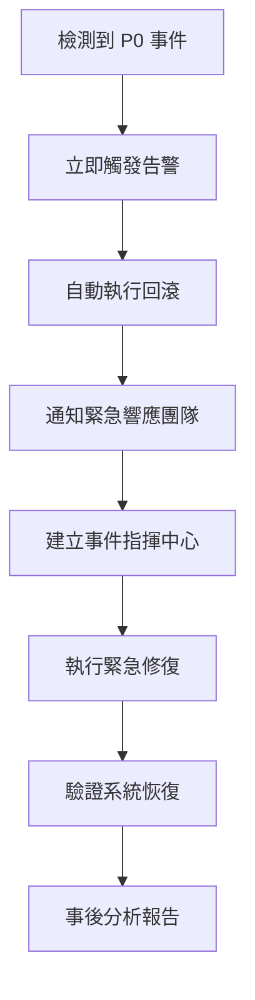

# 🛡️ 自動駕駛級 CI/CD 合規與審計框架

## 1. 完整的變更追蹤

### 審計日誌結構

```json
{
  "change_id": "CHG-2025-001234",
  "timestamp": "2025-11-25T15:02:00Z",
  "actor": "ci-system@company.com",
  "action": "DEPLOY",
  "environment": "production",
  "version": "v1.2.3",
  "risk_assessment": {
    "score": 25,
    "level": "LOW",
    "factors": [
      "code_complexity: LOW",
      "test_coverage: 95%",
      "security_scan: PASSED",
      "performance: NORMAL"
    ]
  },
  "deployment_strategy": "FULL_DEPLOY",
  "result": "SUCCESS",
  "rollback_available": true,
  "previous_version": "v1.2.2"
}
```

## 2. 關鍵決策點的人工審查

| 風險等級 | 自動化程度 | 人工審查 | 決策時間 |
|---------|----------|--------|--------|
| LOW | 100% | 可選 | 即時 |
| MEDIUM | 70% | 必須 | 15 分鐘 |
| HIGH | 30% | 必須 | 1 小時 |
| CRITICAL | 0% | 必須 | 立即 |

## 3. 故障恢復時間目標（RTO）

- **CRITICAL**：< 5 分鐘（自動回滾）
- **HIGH**：< 15 分鐘（金絲雀回滾）
- **MEDIUM**：< 1 小時（分階段回滾）
- **LOW**：< 4 小時（標準回滾）

## 4. 系統維護程序

### 4.1 日常維護清單

#### 每日維護任務（自動化）
- [x] 系統健康檢查
- [x] 關鍵服務可用性驗證
- [x] 資源使用監控
- [x] 安全漏洞掃描
- [x] 備份狀態驗證

#### 每週維護任務
- [ ] 審查系統日誌和告警
- [ ] 分析性能趨勢
- [ ] 更新依賴和補丁
- [ ] 容量規劃評估
- [ ] 災難恢復測試（抽樣）

#### 每月維護任務
- [ ] 完整系統健康審計
- [ ] 安全合規審查
- [ ] 性能基準測試
- [ ] 文檔更新審查
- [ ] 運維訓練和演練

#### 每季維護任務
- [ ] 完整災難恢復演練
- [ ] 架構審查和優化
- [ ] 容量擴展規劃
- [ ] 合規審計報告
- [ ] 年度預算規劃

### 4.2 維護模式操作

#### 啟用維護模式
```bash
# 設置工作流程環境變量
gh variable set MAINTENANCE_MODE --body "true" --repo we-can-fix/slasolve

# 或在 .github/workflows/autonomous-ci-guardian.yml 中設置
env:
  MAINTENANCE_MODE: "true"
```

#### 維護模式功能
- **部署閘門**: 阻止所有自動部署
- **只讀操作**: 僅允許讀取和監控操作
- **告警抑制**: 降低非關鍵告警級別
- **降級服務**: 啟用最小功能集

#### 退出維護模式
```bash
gh variable set MAINTENANCE_MODE --body "false" --repo we-can-fix/slasolve
```

### 4.3 故障排除指南

#### 常見問題診斷流程

##### 問題 1: 健康檢查失敗
```bash
# 1. 檢查服務狀態
docker-compose ps

# 2. 查看服務日誌
docker-compose logs [service-name]

# 3. 檢查網路連接
curl -f http://localhost:8001/health

# 4. 驗證資源可用性
docker stats

# 5. 重啟服務
docker-compose restart [service-name]
```

##### 問題 2: 風險評估異常高
```bash
# 1. 檢查最近提交
git log -10 --oneline

# 2. 審查代碼複雜度
find . -name "*.ts" -o -name "*.js" | xargs wc -l

# 3. 運行安全掃描
npm audit

# 4. 檢查測試覆蓋率
npm test -- --coverage

# 5. 分析變更影響
git diff --stat HEAD~1
```

##### 問題 3: 部署回滾
```bash
# 1. 確認當前版本
git describe --tags

# 2. 識別上一個穩定版本
git tag -l | tail -5

# 3. 執行回滾
git checkout [previous-version]
docker-compose build --no-cache
docker-compose up -d

# 4. 驗證回滾成功
curl -f http://localhost:8001/health

# 5. 記錄回滾事件
echo "Rollback to [version] at $(date)" >> rollback.log
```

##### 問題 4: 性能降級
```bash
# 1. 收集性能指標
docker stats --no-stream

# 2. 分析響應時間
for i in {1..10}; do
  curl -w '%{time_total}\n' -o /dev/null -s http://localhost:8001/health
done

# 3. 檢查資源瓶頸
top -b -n 1 | head -20

# 4. 優化配置
# 調整 docker-compose.yml 中的資源限制

# 5. 應用優化並驗證
docker-compose up -d
```

### 4.4 緊急響應程序

#### 嚴重性級別定義

| 級別 | 描述 | 響應時間 | 升級路徑 |
|------|------|---------|---------|
| P0 - 致命 | 生產完全中斷 | < 5 分鐘 | 立即升級至 CTO |
| P1 - 嚴重 | 關鍵功能受損 | < 15 分鐘 | 升級至工程總監 |
| P2 - 重要 | 部分功能降級 | < 1 小時 | 通知團隊負責人 |
| P3 - 一般 | 輕微影響 | < 4 小時 | 記錄到工單系統 |

#### P0 致命事件響應流程



#### 緊急聯繫方式

```json
{
  "emergency_contacts": {
    "primary_oncall": {
      "slack": "#critical-alerts",
      "pagerduty": "autonomous-system-oncall",
      "phone": "請配置實際電話號碼"
    },
    "backup_oncall": {
      "slack": "#backup-oncall",
      "email": "backup-team@example.com",
      "phone": "請配置實際電話號碼"
    },
    "management_escalation": {
      "email": "engineering-leadership@example.com",
      "phone": "請配置實際電話號碼"
    }
  }
}
```

> ⚠️ **配置提醒**: 在生產環境使用前，請將上述聯繫方式替換為實際的緊急聯繫信息

## 5. 運營指標和 SLA

### 5.1 關鍵性能指標（KPI）

#### 系統可用性
- **目標**: 99.99% (4個9)
- **測量**: 運行時間 / (運行時間 + 停機時間)
- **報告**: 每月

#### 平均修復時間（MTTR）
- **目標**: < 15 分鐘
- **測量**: 從故障檢測到完全恢復的時間
- **報告**: 每週

#### 平均故障間隔（MTBF）
- **目標**: > 720 小時（30天）
- **測量**: 故障之間的平均運行時間
- **報告**: 每月

#### 變更失敗率
- **目標**: < 2%
- **測量**: 失敗部署 / 總部署次數
- **報告**: 每週

#### 部署頻率
- **目標**: 每天多次
- **測量**: 成功部署到生產的次數
- **報告**: 每週

### 5.2 SLA 承諾

#### 服務等級協議

| 服務 | 可用性 | 響應時間 | 吞吐量 | 支援級別 |
|------|--------|---------|--------|---------|
| 關鍵服務 | 99.99% | < 100ms | 10000 req/s | 24/7 |
| 重要服務 | 99.9% | < 500ms | 1000 req/s | 工作時間 |
| 一般服務 | 99.5% | < 2s | 100 req/s | 最佳努力 |

#### 降級服務承諾
- **部分降級**: 核心功能保持可用
- **完全降級**: 只讀模式，數據保持一致
- **計劃維護**: 提前 48 小時通知

### 5.3 監控和告警策略

#### 三層監控體系

##### L1: 基礎設施監控
```yaml
metrics:
  - cpu_usage:
      warning: 70%
      critical: 90%
  - memory_usage:
      warning: 75%
      critical: 90%
  - disk_usage:
      warning: 80%
      critical: 95%
  - network_latency:
      warning: 100ms
      critical: 500ms
```

##### L2: 應用監控
```yaml
metrics:
  - response_time:
      p95: 500ms
      p99: 1000ms
  - error_rate:
      warning: 1%
      critical: 5%
  - request_rate:
      min: 10/s
      max: 10000/s
  - active_connections:
      max: 1000
```

##### L3: 業務監控
```yaml
metrics:
  - transaction_success_rate:
      target: 99.9%
  - user_satisfaction_score:
      target: 4.5/5
  - critical_path_completion:
      target: 98%
```

#### 告警規則

```python
# 告警嚴重性決策樹
def calculate_alert_severity(metric, threshold):
    if metric.service in CRITICAL_SERVICES:
        if metric.value > threshold.critical:
            return "P0"
        elif metric.value > threshold.warning:
            return "P1"
    elif metric.service in IMPORTANT_SERVICES:
        if metric.value > threshold.critical:
            return "P1"
        elif metric.value > threshold.warning:
            return "P2"
    else:
        return "P3"
```

## 6. 審計和合規報告

### 6.1 審計日誌要求

#### 必須記錄的事件
1. **變更事件**
   - 所有部署操作
   - 配置變更
   - 權限修改
   - 系統升級

2. **安全事件**
   - 認證嘗試（成功/失敗）
   - 授權決策
   - 漏洞檢測
   - 異常訪問模式

3. **運營事件**
   - 系統啟動/關閉
   - 備份/恢復操作
   - 維護窗口
   - 性能異常

#### 審計日誌格式
```json
{
  "event_id": "EVT-2025-001234",
  "timestamp": "2025-11-26T10:30:00Z",
  "event_type": "DEPLOYMENT",
  "severity": "INFO",
  "actor": {
    "type": "SERVICE_ACCOUNT",
    "id": "ci-system@example.com",
    "ip": "10.0.0.1"
  },
  "target": {
    "type": "SERVICE",
    "id": "flight-control",
    "version": "v1.2.3"
  },
  "action": "DEPLOY",
  "result": "SUCCESS",
  "metadata": {
    "risk_level": "LOW",
    "approval_required": false,
    "automated": true
  },
  "trace_id": "trace-abc123"
}
```

### 6.2 合規檢查清單

#### SOC 2 合規要求
- [x] 存取控制和認證
- [x] 加密傳輸和儲存
- [x] 變更管理流程
- [x] 監控和告警機制
- [x] 事件響應計劃
- [x] 備份和災難恢復
- [x] 審計日誌保留（90天+）

#### ISO 27001 合規要求
- [x] 資訊安全政策
- [x] 風險評估程序
- [x] 資產管理
- [x] 存取控制
- [x] 密碼學控制
- [x] 運營安全
- [x] 持續改進

### 6.3 定期審計報告

#### 每週運營報告
```markdown
# 週運營報告：2025-W47

## 摘要
- 部署次數：42
- 成功率：98.5%
- 平均 MTTR：12 分鐘
- 可用性：99.97%

## 關鍵事件
- 1 次 P2 事件（性能降級）
- 0 次 P0/P1 事件

## 改進措施
- 優化部署流程
- 增強監控覆蓋
```

#### 每月合規報告
```markdown
# 月合規報告：2025-11

## SLA 達成情況
- 系統可用性：99.98% ✅
- MTTR：14 分鐘 ✅
- 變更失敗率：1.8% ✅

## 審計發現
- 0 個嚴重問題
- 2 個輕微改進建議

## 下月重點
- 災難恢復演練
- 安全培訓更新
```

## 7. 最佳實踐和建議

### 7.1 運維最佳實踐

1. **自動化優先**
   - 所有可重複任務都應自動化
   - 使用基礎設施即代碼（IaC）
   - 實施 GitOps 工作流程

2. **觀察性驅動**
   - 建立全面的監控體系
   - 實施分佈式追蹤
   - 收集結構化日誌

3. **持續改進**
   - 定期審查和優化流程
   - 從事件中學習（事後分析）
   - 分享知識和經驗

4. **安全至上**
   - 默認安全配置
   - 最小權限原則
   - 定期安全審計

### 7.2 團隊協作建議

1. **明確責任分工**
   - 輪值制度（on-call rotation）
   - 文檔化的升級路徑
   - 清晰的決策權限

2. **有效溝通**
   - 使用統一的溝通渠道
   - 及時更新事件狀態
   - 透明的信息共享

3. **知識管理**
   - 維護運維手冊
   - 記錄常見問題解決方案
   - 定期知識分享會議

### 7.3 工具和資源

#### 推薦工具
- **監控**: Prometheus, Grafana, Datadog
- **日誌**: ELK Stack, Loki, Splunk
- **告警**: PagerDuty, Opsgenie, VictorOps
- **CI/CD**: GitHub Actions, GitLab CI, Jenkins
- **容器**: Docker, Kubernetes, Helm

#### 學習資源
- [Site Reliability Engineering Book](https://sre.google/books/)
- [The DevOps Handbook](https://itrevolution.com/product/the-devops-handbook/)
- [Kubernetes Best Practices](https://kubernetes.io/docs/concepts/)

---

## 附錄

### A. 術語表

| 術語 | 定義 |
|------|------|
| MTTR | 平均修復時間（Mean Time To Repair） |
| MTBF | 平均故障間隔（Mean Time Between Failures） |
| SLA | 服務等級協議（Service Level Agreement） |
| RTO | 恢復時間目標（Recovery Time Objective） |
| RPO | 恢復點目標（Recovery Point Objective） |

### B. 版本歷史

| 版本 | 日期 | 變更說明 |
|------|------|---------|
| 2.0 | 2025-11-26 | 新增維護程序、故障排除指南和運營指標 |
| 1.0 | 2025-11-25 | 初始版本：基本合規框架 |

### C. 聯繫信息

**文檔維護**: DevOps Team  
**最後更新**: 2025-11-26  
**審閱週期**: 季度

---

*本文檔是動態文檔，會根據實際運營經驗持續更新和改進。*
