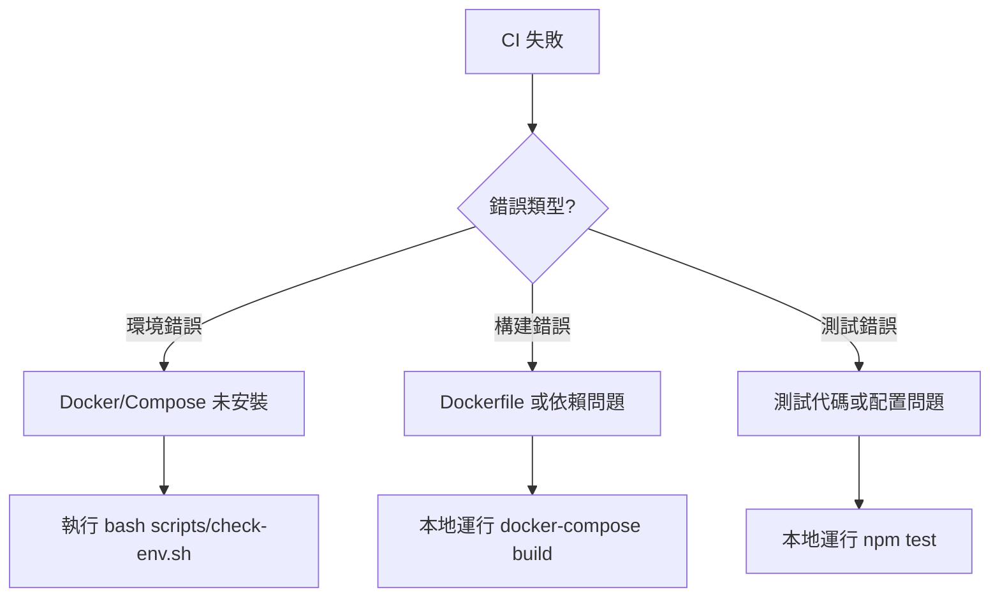

# CI 故障排除 Runbook

## 快速診斷流程



## 常見錯誤與解決方案

### 錯誤 1：Docker Compose 未安裝

**症狀**：
```
Error: docker-compose: command not found
```

**根本原因**：
- Runner 環境未更新
- 本地環境不同步

**解決方案**：

```bash
# 方案 A：本地安裝
curl -L "https://github.com/docker/compose/releases/download/v2.20.0/docker-compose-$(uname -s)-$(uname -m)" \
  -o /usr/local/bin/docker-compose
sudo chmod +x /usr/local/bin/docker-compose

# 方案 B：使用 Docker 插件（推薦）
docker run --rm -v /usr/local/bin:/output \
  docker/compose:v2.20.0 cp /docker-compose /output/
chmod +x /usr/local/bin/docker-compose

# 驗證
docker-compose --version
# 或使用 Docker Compose Plugin
docker compose version
```

**預防措施**：
- 在 workflow 中添加初始化步驟
- 定期更新 Runner 環境

---

### 錯誤 2：磁盤空間不足

**症狀**：
```
Error: No space left on device
docker: Error response from daemon: write /var/lib/docker/...: no space left on device
```

**根本原因**：
- Docker 鏡像堆積
- 舊容器未清理

**解決方案**：

```bash
# 清理所有未使用的資源
docker system prune -a --volumes

# 查看磁盤使用
docker system df

# 手動清理
docker rmi $(docker images -q)  # 刪除所有鏡像
docker volume prune              # 刪除未使用的卷
```

**預防措施**：
- 在 workflow 中定期執行 `docker system prune`
- 限制鏡像層數

---

### 錯誤 3：Dockerfile 語法錯誤

**症狀**：
```
Error parsing reference: "ubuntu:22.04 AS builder"
```

**根本原因**：
- Dockerfile 語法不正確
- 基礎鏡像版本不存在

**解決方案**：

```bash
# 本地驗證 Dockerfile
docker build --tag test:latest . --progress=plain

# 檢查特定行
hadolint Dockerfile

# 查看完整構建日誌
docker build --tag test:latest . --progress=plain --no-cache
```

**常見修正**：

```dockerfile
# ❌ 錯誤
FROM ubuntu:22.04 AS builder
RUN apt-get install python3

# ✅ 正確
FROM ubuntu:22.04 AS builder
RUN apt-get update && apt-get install -y python3
```

---

### 錯誤 4：測試超時

**症狀**：
```
Test timeout: test did not complete within 30000ms
```

**根本原因**：
- 服務啟動過慢
- 測試環境配置不完整

**解決方案**：

```bash
# 增加超時時間
npm test -- --testTimeout=60000

# 檢查服務狀態
docker-compose ps

# 查看服務日誌
docker-compose logs app

# 手動啟動並測試
docker-compose up -d
sleep 5  # 等待服務啟動
docker-compose exec -T app npm test
```

---

### 錯誤 5：npm ci 在 Docker 容器中失敗

**症狀**：
```
Exit handler never called!
npm ERR! This is an error with npm itself.
```

**根本原因**：
- Docker 容器環境中的 npm ci 已知問題
- 容器內記憶體或資源限制

**解決方案**：

```bash
# 方案 A：本地使用 npm install 替代 npm ci
npm install

# 方案 B：在主機上運行測試而非容器內
npm install --workspaces
npm test

# 方案 C：考慮使用 pnpm 替代 npm
npm install -g pnpm
pnpm install
pnpm test
```

**預防措施**：
- 在 CI workflow 中避免在 Docker 容器內運行 npm ci
- 使用主機環境運行測試（如 core-services-ci.yml）
- 考慮使用其他套件管理器（pnpm, yarn）

---

### 錯誤 6：Node.js 版本不符

**症狀**：
```
Error: The engine "node" is incompatible with this module.
Expected version ">=18.0.0".
```

**根本原因**：
- 本地 Node.js 版本過舊
- 環境中安裝了錯誤的 Node.js 版本

**解決方案**：

```bash
# 檢查當前版本
node --version

# 方案 A：使用 nvm 安裝指定版本
curl -o- https://raw.githubusercontent.com/nvm-sh/nvm/v0.39.0/install.sh | bash
nvm install 18
nvm use 18

# 方案 B：從官方網站下載
# 訪問 https://nodejs.org/

# 驗證安裝
node --version  # 應該顯示 v18.x.x 或更高
npm --version
```

---

## 自動化修復清單

| 錯誤 | 自動檢查 | 自動修復 | 手動介入 |
|------|--------|--------|--------|
| Docker 未安裝 | ✓ | ✗ | 需要 |
| Docker Compose 未安裝 | ✓ | ✗ | 需要 |
| 磁盤空間不足 | ✓ | ✓ | 可選 |
| Dockerfile 錯誤 | ✓ | ✗ | 需要 |
| 測試失敗 | ✓ | ✗ | 需要 |
| npm ci Docker 問題 | ✓ | ✓ | 可選 |
| Node.js 版本不符 | ✓ | ✗ | 需要 |

---

## 常用調試命令

### Docker 調試

```bash
# 檢查 Docker 狀態
docker --version
docker info

# 查看運行中的容器
docker ps

# 查看所有容器（包括停止的）
docker ps -a

# 查看鏡像
docker images

# 查看容器日誌
docker logs <container-id>

# 進入容器
docker exec -it <container-id> /bin/bash

# 清理系統
docker system prune -a --volumes
```

### Docker Compose 調試

```bash
# 檢查配置
docker-compose config

# 啟動服務（前台）
docker-compose up

# 啟動服務（後台）
docker-compose up -d

# 查看服務狀態
docker-compose ps

# 查看服務日誌
docker-compose logs

# 停止服務
docker-compose down

# 重建並啟動
docker-compose up --build
```

### npm/Node.js 調試

```bash
# 檢查 Node.js 版本
node --version

# 檢查 npm 版本
npm --version

# 清理 npm 緩存
npm cache clean --force

# 重新安裝依賴
rm -rf node_modules package-lock.json
npm install

# 運行測試（詳細輸出）
npm test -- --verbose

# 檢查 workspace 狀態
npm list --workspaces
```

---

## 本地環境檢查

使用提供的環境檢查腳本快速診斷問題：

```bash
# 運行環境檢查
bash scripts/check-env.sh

# 預期輸出（成功情況）
╔════════════════════════════════════════╗
║     CI 環境檢查與自動修復工具          ║
╚════════════════════════════════════════╝

[1/4] 檢查 Docker...
✓ docker 已安裝：Docker version 24.0.0, build abcdef

[2/4] 檢查 Docker Compose...
✓ docker-compose 已安裝：Docker Compose version v2.20.0

[3/4] 檢查 Node.js...
✓ node 已安裝：v18.17.0

[4/4] 檢查 Git...
✓ git 已安裝：git version 2.41.0

[磁盤空間]
✓ 磁盤空間充足：45%

╔════════════════════════════════════════╗
║     環境檢查通過 - 準備就緒！        ║
╚════════════════════════════════════════╝
```

---

## CI Workflow 結構

CI 自動評論系統包含三個主要階段：

1. **環境檢查階段** (`environment-check`)
   - 檢查 Docker 安裝
   - 檢查 Docker Compose 安裝
   - 生成錯誤報告和建議

2. **構建與測試階段** (`build-and-test`)
   - 構建 Docker 鏡像
   - 運行單元測試和集成測試
   - 生成測試報告

3. **自動評論階段** (`auto-comment`)
   - 根據前面階段的結果自動生成 PR 評論
   - 添加或移除相應的標籤
   - 提供具體的修復步驟

---

## 聯繫支持

若以上解決方案無法解決問題，請聯繫：

- **GitHub Issues**：https://github.com/we-can-fix/slasolve/issues
- **文檔**：查看 [README.md](../README.md) 獲取更多資訊
- **CI 配置**：`.github/workflows/ci-auto-comment.yml`

---

## 參考資源

- [Docker 官方文檔](https://docs.docker.com/)
- [Docker Compose 官方文檔](https://docs.docker.com/compose/)
- [Node.js 官方文檔](https://nodejs.org/)
- [GitHub Actions 文檔](https://docs.github.com/en/actions)
- [npm 文檔](https://docs.npmjs.com/)
